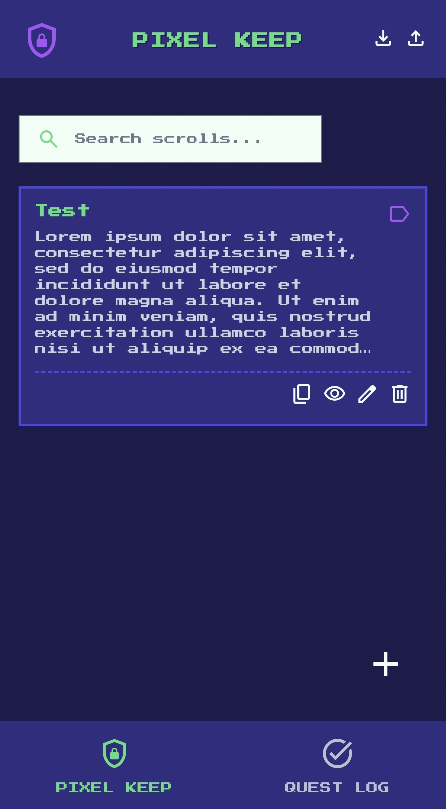
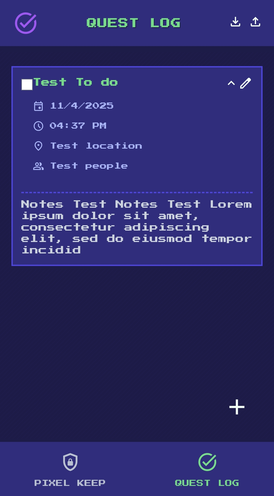
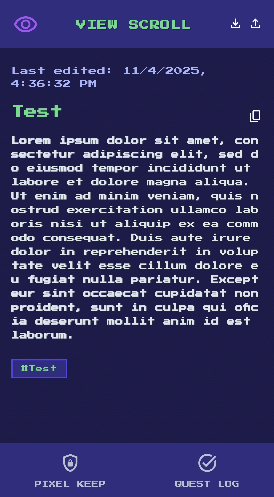

# PixelNotes PWA - Pixel Keep & Quest Log

**Live Version:** [**https://pixelkeep.web.app**](https://pixelkeep.web.app)

A secure, offline-first Progressive Web App (PWA) for creating and managing encrypted notes and to-do lists with a retro "pixel art" aesthetic.


## Screenshots





## Features

*   **Offline First:** Fully functional without an internet connection thanks to a Service Worker.
*   **Secure & Private:** All your data is encrypted using AES via `crypto-js` and stored locally in your browser's IndexedDB.
*   **Password Protection:** A password is required to unlock and decrypt your notes and quests.
*   **Note Taking:** A simple rich text editor for your notes.
*   **Quest Log:** A to-do list to keep track of your tasks.
*   **Image Support:** Embed images from your gallery or camera directly into your notes.
*   **Data Portability:** Export and import your data as a JSON file.
*   **Installable:** As a PWA, PixelNotes can be installed on your desktop or mobile device for a native-app-like experience.

## Tech Stack

*   **Frontend:** Vanilla HTML, CSS, and JavaScript
*   **Styling:** Tailwind CSS
*   **Offline Storage:** IndexedDB with the `idb` library
*   **Encryption:** `crypto-js`
*   **PWA:** Service Worker and Web App Manifest
*   **Deployment:** Firebase Hosting

## Getting Started

This is a client-side application with no build process.

### Prerequisites

You just need a modern web browser. To run it locally, you'll need a local web server.

### Running Locally

1.  Clone this repository.
2.  Navigate to the project directory.
3.  Start a local web server.

    *Using Python:*
    ```bash
    python -m http.server
    ```
    Then open `http://localhost:8000` in your browser.

    *Using Node.js (with `http-server`):*
    ```bash
    npm install -g http-server
    http-server .
    ```
    Then open `http://localhost:8080` in your browser.

## Deployment

This project is configured for easy deployment with Firebase Hosting.

1.  **Install Firebase CLI:**
    ```bash
    npm install -g firebase-tools
    ```
2.  **Login to Firebase:**
    ```bash
    firebase login
    ```
3.  **Deploy:**
    ```bash
    firebase deploy
    ```

## License

This project is licensed under the MIT License.
