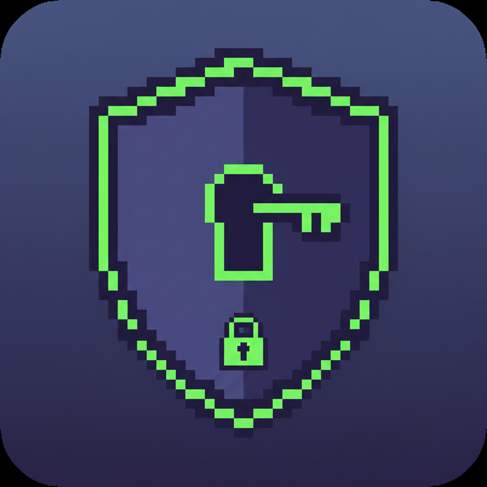

# PixelKeep Refactor (PWA)

PixelKeep is a secure, local-first Progressive Web App (PWA) for managing encrypted notes and quests with a charming retro 8-bit pixel-art aesthetic. It empowers users to take control of their data with client-side encryption and high-performance offline capabilities.



## 🚀 Key Features

- **Local-First & Secure:** All data is encrypted using AES-256 (via `crypto-js`) and stored locally in your browser's IndexedDB. No server-side storage means your data belongs to you.
- **High Performance Mode:** New setting to disable encryption for the Quest Log (tasks), allowing for a lightning-fast experience while keeping Notes fully secured.
- **Native OS Integration (PWA):**
    - **Native Share Target:** Share links, text, and files directly to PixelKeep from other apps.
    - **Native File Handling:** Open `.txt`, `.md`, and `.json` files directly within PixelKeep from your device's file manager.
    - **App Shortcuts:** Long-press the icon to jump directly into "New Note" or "New Quest".
    - **Icon Badging:** See your active quest count directly on the app icon.
    - **Robust Offline Support:** Complete precaching of all assets and runtime caching for external fonts.
- **Hierarchical Organization:** Organize notes and quests into nested folders with drag-and-drop support.
- **Rich Note Editing:** 
    - Text formatting (Bold, Italic, Underline, Lists).
    - Multimedia support: Record or upload audio, capture or import images.
    - **Advanced Image Handling:** Resizing and dragging handles for images within the editor.
- **Quest Log (Tasks):** 
    - Track tasks with due dates, locations, and involved people.
    - Custom Alarm/Reminder system with snooze and repeat functionality.
- **Immersive Customization:**
    - Multiple Themes: Standard and "Pixel" (8-bit).
    - Custom Fonts: Support for pixel fonts and modern readable fonts (Inter, Roboto, Exo, etc.).
    - Interface Scaling: Adjust the UI scale to fit your device and preference.

## 🛠 Tech Stack

- **Framework:** [React 18](https://reactjs.org/)
- **Language:** [TypeScript](https://www.typescriptlang.org/)
- **Build Tool:** [Vite](https://vitejs.dev/)
- **State Management:** [Zustand](https://github.com/pmndrs/zustand)
- **Database:** [Dexie.js](https://dexie.org/) (IndexedDB wrapper)
- **Background Workers:** Dedicated workers for **Decryption** and **Audio Transcription** (Whisper Tiny).
- **Styling:** [Tailwind CSS](https://tailwindcss.com/)
- **Encryption:** [Crypto-js](https://github.com/brix/crypto-js)
- **PWA Support:** [vite-plugin-pwa](https://vite-pwa-org.netlify.app/)

## 📦 Getting Started

### Prerequisites

- [Node.js](https://nodejs.org/) (v18 or higher)
- [npm](https://www.npmjs.com/)

### Installation

1.  Clone the repository:
    ```bash
    git clone <repository-url>
    cd PixelKeepRefactor
    ```

2.  Install dependencies:
    ```bash
    npm install
    ```

3.  Start the development server:
    ```bash
    npm run dev
    ```

4.  Open `http://localhost:5173` in your browser.

## 🏗 Build & Deployment

### Production Build

To create a production-ready build, run:

```bash
npm run build
```

This will run TypeScript checks and generate the static files in the `dist/` directory.

### Deployment

The project is designed to be hosted on any static hosting service.

#### Firebase Hosting (Recommended)

1.  Initialize Firebase: `firebase init`
2.  Deploy: `firebase deploy`

## 📂 Project Structure

```text
src/
├── components/     # UI components (PixelButton, PixelModal, AlarmManager, etc.)
├── db/             # Dexie.js database schema
├── hooks/          # Custom hooks (useAudioRecorder, etc.)
├── stores/         # Zustand stores (Centralized logic & Optimistic UI)
├── utils/          # Utility functions (Encryption, Storage Manager, UI)
├── views/          # Main views (NotesList, QuestLog, ShareTarget, etc.)
├── workers/        # Web Workers (Decryption, Transcription)
├── App.tsx         # Routing and Global Theme Logic
└── main.tsx        # Entry point
```

## 🤖 AI Agent Integration

This project is optimized for assistance from AI agents. For specific instructions, please refer to [AGENTS.md](./AGENTS.md).

## 📄 License

This project is licensed under the MIT License.

---

*Keep your pixels secure and your quests organized.*